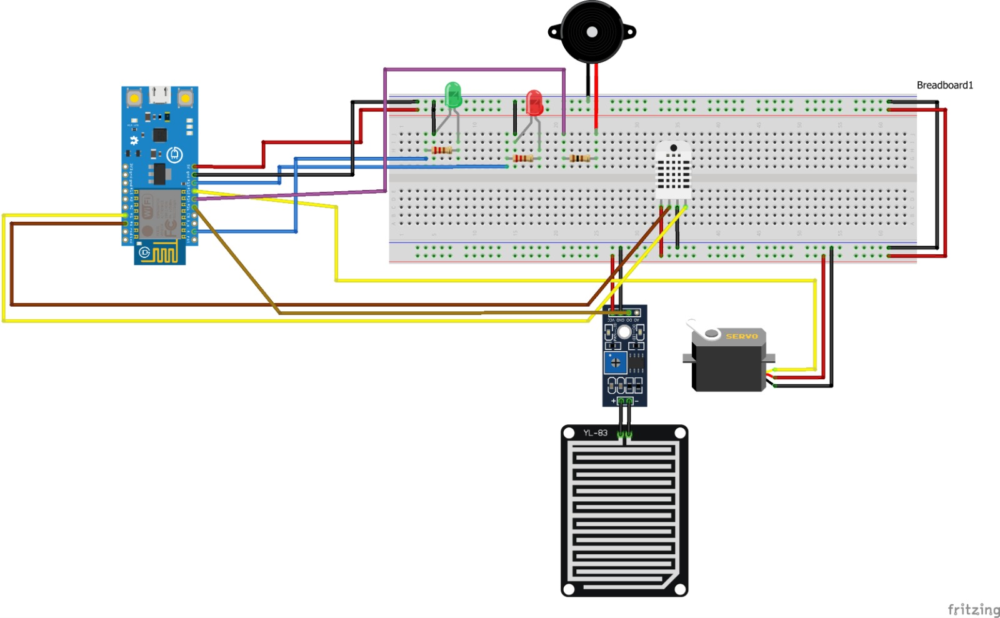

# SmartyPlantsIoT
Smarty Plants is an IoT project, a smart system for managing a small greenhouse.

System components:
 - Croduino Nova2 - ESP8266
     - sends measured data to Raspberry Pi 3 using MQTT and WiFi
 - SG90 servo
     - used to imitate opening and closing of the greenhouse roof
 - Rain sensor
     - detects rainfall which, combined with low humidity, triggers roof opening
 - Piezzo buzzer
     - serves as an alarm, buzzes when humidity is low or temperature is high
 - Red and Green LED
     - Red LED is on when conditions are critical, Green LED is on when conditions are ideal
 - DHT22 sensor
     - measures humidity and temperature
 - Raspberry Pi 3
     - hosts the webserver and mariadb database
     - subscribes to an mqtt topic to read the data sent by ESP, which is then stored in a database
     - connected to the same network as ESP

## Pinout

### Project structure

SmartyPlantsIoT/python
 - contains a python script for reading data sent by ESP and storing it in a database and a script for reading the data from the database and displaying it in a web app

SmartyPlantsIoT/SmartyPlantsWebFront
 - contains the frontend of the web app

SmartyPlantsIoT/ESP8266
 - contains the arduino code that measures sensor data, publishes it and manages other components
